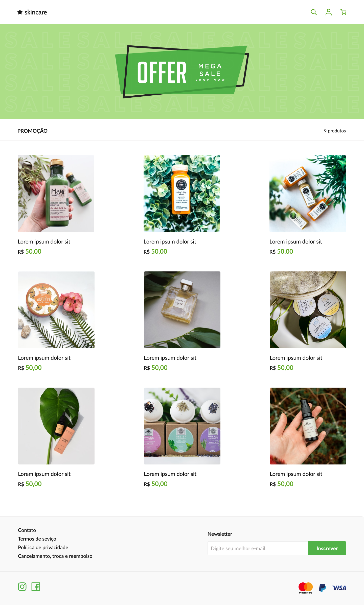

 

 
   

  <h3 align="center">selfcare</h3>

  

    Crie uma página para exibição de produtos
        
     
    <a href="https://github.com/thaysagomes/selfcare">Desafio</a>
    ·
    <a href="https://www.linkedin.com/in/tcgms/">Contato</a>
  

# Devchallenge 
<a href="https://devchallenge.now.sh/">DevChallenge</a> permite que você evolua suas skills como programador!

# Desafio
Seu desafio será construir uma página para exibição de produtos de uma loja online chamada <strong>selfcare</strong>.   

# Techs: 
HTML 
CSS 
Framework ou linguagem que preferir

# Como começar:
1 - Use esse template (clicando em Use this template) ou faça um fork deste repositório com o código inicial 
2 - Leia as instruções no readme.md 
3 - Comece a codar! 
4 - Compartilhe seu resultado com a comunidade :) 

# Requisitos:
- Sua página deve se parecer o mais próximo possível do design 
- Sua página deve ser responsiva 

# Cores:
Verde: #5CA720 
Preto: #161616 
Cinza (linhas divisórias): #A5A1A1 
Cinza (background do footer): #F9F9F9

# Design:
Modelo está disponível na pasta `./design` 
Imagens estão disponíveis na pasta `./assets` 

- O layout pode ser visto e copiado diretamente do Figma por este link: https://www.figma.com/file/d3XuxUt94vr0o4kBSo7IHC/Dev-Challenge?node-id=0%3A1. Nesse arquivo, você pode exportar imagens e ícones como desejar. 

# Fonte utilizada:
- Lato

# Compartilhe!
- Inicie seu projeto utilizando esse template no seu github como um repositório público 
- Faça um print, gif ou vídeo e compartilhe o resultado no seu Linkedin 
- Você também pode adicionar uma "issue" neste repositório mostrando seu resultado final! 

Desafio criado por <a href="https://github.com/thaysagomes">Thaysa Gomes</a> :)
